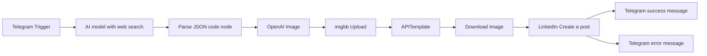

# Telegram to LinkedIn: AI Post and Image Automation

An n8n workflow that turns a one-line topic sent to a Telegram bot into a researched LinkedIn post of 250 words or fewer, adds an AI-generated infographic with a branded profile footer, and publishes both to LinkedIn.

I send a topic like "Why you must use AI for SEO in 2026". A few minutes later the post is live, and Telegram tells me whether it worked.

## How it works



1. **Telegram Trigger** receives the topic.
2. **AI model** (OpenAI, with web search turned on) researches the topic using the current date, then writes the post and a brief for an infographic. The reply uses plain text markers instead of JSON (see [Why markers instead of JSON](#why-markers-instead-of-json)).
3. **Parse JSON** (a Code node, despite the name) splits the reply into `post` and `image_prompt` and rejects anything cut off, too short or over the word limit.
4. **OpenAI Image** generates a square 1024 x 1024 infographic from the brief. The API returns the image as base64, not a URL.
5. **imgbb Upload** turns the base64 image into a public URL.
6. **APITemplate** places that image at the top of a 1080 x 1200 template. The bottom 120 px holds my photo, name, handle and a follow line. The footer is fixed inside the template, so the AI never has to draw a face or small text.
7. **Download Image** fetches the rendered PNG as a binary file.
8. **LinkedIn** creates the post with the text and the image.
9. **Telegram** sends a success or error message back to the same chat.

## What you need

| Service | Used for | Where to get the credential |
|---|---|---|
| n8n (cloud or self-hosted) | Runs the workflow | n8n account or your own server |
| Telegram bot | Input and status messages | Create a bot with @BotFather |
| OpenAI API | Post writing, web search, image generation | platform.openai.com (API billing is separate from a ChatGPT subscription) |
| imgbb | Temporary public URL for the generated image | api.imgbb.com |
| APITemplate.io | Combines the image with the profile footer | Dashboard, API Integration page |
| LinkedIn | Publishing | n8n LinkedIn OAuth credential |

Check each service's pricing page before running this regularly. Image cost depends on the quality setting you choose.

## Setup

### 1. Credentials in n8n

Create these as separate credentials. Do not paste keys into node fields.

| Credential | Type | Name field | Value field |
|---|---|---|---|
| OpenAI Key | Header Auth | `Authorization` | `Bearer YOUR_OPENAI_KEY` (one space after Bearer) |
| APITemplate Key | Header Auth | `X-API-KEY` | `YOUR_APITEMPLATE_KEY` |
| Telegram | Telegram API | n/a | Bot token from BotFather |
| LinkedIn | LinkedIn OAuth2 | n/a | Follow the n8n LinkedIn credential guide |

The imgbb key is not a header. It goes in a query parameter named `key` on the imgbb node.

In Header Auth, the **Name** field is the technical header name, not a label. Put your own label in the credential title. Using a label with spaces in the Name field causes `Header name must be a valid HTTP token`.

### 2. APITemplate template

1. Create an image template with a canvas of **1080 x 1200**.
2. Add a background rectangle covering the whole canvas.
3. Add an image layer at x 0, y 0, size 1080 x 1080. This is where the generated infographic goes. Note its exact layer name. In my template it is `background-image`.
4. Add a footer rectangle at y 1080, size 1080 x 120.
5. In the footer, add a circular profile photo, your name, your handle and a follow line such as "Follow for more AI & SEO tips". Keep text boxes inside the canvas edges.
6. Save the template and copy the Template ID from the Integrations tab or the template list.
7. In the Preview/API Console, click **Generate JSON Data** to see the real layer names, then test with a public image URL and click **Generate Image**.

The layer name in the n8n request must match the template exactly, including capitals and hyphens.

### 3. Node settings

**Telegram Trigger:** listens for messages (`message` update).

**AI model node (OpenAI, Message a model):**
- Prompt: see [`prompts/linkedin-post-prompt.md`](prompts/linkedin-post-prompt.md). Set the field to Expression mode so the topic and date fill in.
- Built-in tools: web search on.
- Maximum Number of Tokens: `8000`. If the output shows `status: incomplete`, raise it. Reasoning models spend part of this limit on their own thinking.

**Parse JSON (Code node):** paste the code from [Parse JSON code](#parse-json-code).

**OpenAI Image (HTTP Request):**
- Method `POST`, URL `https://api.openai.com/v1/images/generations`
- Authentication: Header Auth, the OpenAI Key credential
- Body (JSON):

```json
{
  "model": "gpt-image-2",
  "prompt": {{ JSON.stringify($json.image_prompt) }},
  "size": "1024x1024",
  "quality": "medium",
  "n": 1
}
```

- Timeout `180000`, Retry On Fail on.
- If the model name is rejected, try `gpt-image-1`. Do not add `response_format`; these models always return base64.

**imgbb Upload (HTTP Request):**
- Method `POST`, URL `https://api.imgbb.com/1/upload`
- Query parameter `key` with your imgbb key
- Body: Form-Data, one field named `image` with the value `{{ $json.data[0].b64_json }}`
- The public link comes back as `data.url`.

**APITemplate (HTTP Request):**
- Method `POST`, URL `https://rest.apitemplate.io/v2/create-image?template_id=YOUR_TEMPLATE_ID`
- Authentication: Header Auth, the APITemplate Key credential
- Body (JSON):

```json
{
  "overrides": [
    { "name": "background-image", "src": "{{ $json.data.url }}" }
  ]
}
```

**Download Image (HTTP Request):**
- Method `GET`, URL `{{ $json.download_url_png }}`
- Response format: File, put output in field `data`.

**LinkedIn (Create a post):**
- Text: `{{ $('Parse JSON').item.json.post }}`
- Media Category: Image
- Binary Property: `data`

**Telegram messages:**
- Chat ID: `{{ $('Telegram Trigger').item.json.message.chat.id }}`
- Success text can include `{{ $('Parse JSON').item.json.post }}`.
- Connect the LinkedIn node's error output to a second Telegram node.

### Parse JSON code

Handles both OpenAI Responses-style output and Anthropic-style output, checks for cut-off replies, and enforces the word limit.

<details>
<summary>Show code</summary>

```javascript
const item = $input.first().json;

let raw = '';
let incomplete = item.status === 'incomplete';

if (Array.isArray(item.output)) {
  for (const o of item.output) {
    if (o.status === 'incomplete') incomplete = true;
    if (o.type === 'message' && Array.isArray(o.content)) {
      for (const c of o.content) {
        if (c.type === 'output_text' && c.text) raw += c.text + '\n';
      }
    }
  }
} else if (Array.isArray(item.content)) {
  raw = item.content.filter(b => b.type === 'text').map(b => b.text).join('\n');
}

if (!raw.trim()) {
  throw new Error('No text found in the model reply. Check the output structure of the previous node.');
}

const pStart = raw.lastIndexOf('===POST===');
const iStart = raw.indexOf('===IMAGE_PROMPT===', pStart);
if (pStart === -1 || iStart === -1) {
  throw new Error((incomplete ? 'Reply was cut off before the image prompt. Raise Maximum Number of Tokens. ' : 'Markers missing. ') + 'Last 200 characters: ' + raw.slice(-200));
}

let end = raw.indexOf('===END===', iStart);
if (end === -1) {
  if (incomplete) throw new Error('Reply was cut off by the token limit. Raise Maximum Number of Tokens.');
  end = raw.length;
}

const post = raw.slice(pStart + 10, iStart).trim();
const image_prompt = raw.slice(iStart + 18, end).replace(/\s+/g, ' ').trim();

if (post.length < 200 || image_prompt.length < 80) {
  throw new Error('Post or image prompt looks too short. Check the model reply.');
}

const wordCount = post.split(/\s+/).filter(Boolean).length;
if (wordCount > 270) {
  throw new Error('Post is ' + wordCount + ' words. Limit is 250. Run again.');
}

return [{ json: { post, image_prompt } }];
```

</details>

## Why markers instead of JSON

My first version asked the model for JSON. It failed twice: long replies were cut off before the closing brace, and the model put real line breaks inside JSON strings, which is invalid. Plain markers (`===POST===`, `===IMAGE_PROMPT===`, `===END===`) survive both problems, and a missing `===END===` tells the code the reply may be incomplete.

## Troubleshooting

| Symptom | Cause | Fix |
|---|---|---|
| `Header name must be a valid HTTP token` | A label was typed in the Header Auth Name field | Put the header name (`Authorization` or `X-API-KEY`) in Name, and the label in the credential title |
| Parse JSON says the reply is incomplete, model output shows `status: incomplete` | Token limit reached | Raise Maximum Number of Tokens, lower reasoning effort if the option exists |
| Parse JSON finds no text | The model node's output has a different shape than the code expects | Look at the model node's JSON output and adjust the first block of the code |
| imgbb returns `Invalid API v1 key` | The `key` query parameter box is empty or has a space in it | Type the name and paste the value; grey text is only a placeholder |
| Final image still shows the template's sample picture | The layer name in the request does not match the template | Use Generate JSON Data in the API Console to copy the exact name |
| `Referenced node doesn't exist` | A node was renamed or deleted, and an expression still points to the old name | Update the expression to the current node name |
| Text in the infographic has a wrong word | Image models sometimes misspell text | Read every image before publishing (see below) |

## Before you publish anything

- Build and test with the **LinkedIn node disabled**. Open the APITemplate output and look at the rendered PNG first.
- Read the post. The prompt tells the model not to invent facts, but I still check every date and product claim against the official source before it goes out.
- Read the image. Spelling mistakes inside generated infographics happen.
- A Telegram approval step before the LinkedIn node is a good next addition, using Telegram's "send message and wait for response" operation if your n8n version has it.

## Security

- Never commit API keys, bot tokens, Template IDs or your Telegram chat ID.
- n8n workflow exports do not contain credential secrets, but they do contain credential names and IDs. Check the JSON before uploading.
- Crop or blur keys and IDs in any screenshot.

## Repository layout

```
.
├── README.md
├── workflow.json                     # exported from n8n (add this)
├── prompts/
│   └── linkedin-post-prompt.md
└── docs/                             # screenshots (add these)
```

To export the workflow: open it in n8n, use the three-dot menu, and choose Download.

## Limitations

- The infographic depends on an image model reading a text brief. Layout and wording vary from run to run.
- imgbb is used only as a temporary public host for the background image. Read its terms before relying on it.
- The workflow posts to a personal profile only.
- Web search results can be outdated or wrong. The prompt asks for recent official sources, and you still need to review the output.

## Author

Naveen Pandey, SEO and PPC specialist building AI automations with n8n and Make.

LinkedIn: add your profile link here

## License

Add a LICENSE file before publishing. MIT is a common choice for workflow templates.
